# AI Interview Portal

## Project Overview

AI Interview Portal is a web-based interview preparation and assessment platform developed using React and Vite. The application enables students to practice mock interviews, take technical assessments, monitor performance, and track learning progress through analytics dashboards.

The system supports role-based access for Students, Trainers, and Administrators.

---

## Objectives

The objective of this project is to provide a role-based interview preparation and assessment platform where students can practice mock interviews, attempt assessments, track performance, and receive automated feedback. Trainers can monitor student progress, while administrators can manage users, assessments, and analytics.

---

## Features

### Authentication Module

* User Registration
* User Login
* Role-Based Access Control
* Protected Routes
* Form Validation

### Student Module

* Mock Interview Practice
* Technical Assessments
* Assessment Results
* Analytics Dashboard
* Profile Management

### Trainer Module

* Monitor Student Performance
* View Assessment Reports
* Track Student Progress

### Admin Module

* User Management
* Assessment Management
* Performance Reports
* Analytics Overview

### Analytics Module

* Weekly Score Trend
* Skill-wise Performance
* Mock Interview Analytics
* Topic-wise Improvement
* Completion Statistics

### AI Integration Simulation

* Automated Assessment Feedback
* Performance Recommendations
* Improvement Suggestions
* Interview Evaluation Simulation

---

## Technology Stack

### Frontend

* React.js
* Vite
* React Router DOM
* Redux Toolkit
* Tailwind CSS
* Recharts
* React Icons

### Storage

* Local Storage

### Version Control

* Git
* GitHub

### Deployment

* Vercel

---

## Project Structure

```text
src/
│
├── components/
├── layouts/
├── pages/
├── routes/
├── redux/
├── mock/
├── assets/
│
├── App.jsx
├── main.jsx
```

---

## Implemented BRD Requirements

### Coding Standards

* Functional Components
* Hooks-Based Architecture
* Reusable Components
* Clean Folder Structure
* Modular Design
* Avoid Duplicate Code

### Security Requirements

* Protected Routes
* Role-Based Authorization
* Form Validation
* Input Validation
* Unauthorized Access Protection
* No Secrets Stored in Frontend

### Error Handling

* Invalid Login Handling
* Empty Data States
* Unauthorized Access Handling
* Form Validation Errors
* Assessment Validation

### Performance Optimization

* Reusable Components
* Optimized Rendering
* Component-Based Architecture
* Responsive Design

### Analytics Features

* Weekly Score Trend
* Skill-wise Performance
* Mock Interview Analytics
* Topic-wise Improvement
* Completion Statistics

---

## API Integration

This project follows a frontend-only architecture as specified in the BRD.

Current implementation includes:

- Local Storage for data persistence
- Mock data simulation
- Service layer structure for future API integration
- API-ready architecture for backend connectivity

Future enhancements may include:
- Authentication APIs
- Assessment APIs
- Analytics APIs
- User Management APIs

---

## Responsive Design

The application supports:

* Mobile Devices
* Tablets
* Laptops
* Desktop Screens

Responsive layouts were implemented using Tailwind CSS Grid and Flexbox utilities.

---

## Accessibility Features

* Semantic HTML Structure
* Form Labels
* Keyboard Accessible Components
* Responsive Design
* Readable Layout and Contrast

---

## Installation Guide

### Clone Repository

```bash
git clone <repository-url>
```

### Navigate to Project

```bash
cd AI-Interview-Portal
```

### Install Dependencies

```bash
npm install
```

### Start Development Server

```bash
npm run dev
```

### Build Project

```bash
npm run build
```

---

## Setup Guide

1. Clone the repository.
2. Install all dependencies using npm install.
3. Run the application using npm run dev.
4. Open the browser.
5. Access the application locally.

---

## User Roles

### Student

* Dashboard
* Mock Interviews
* Assessments
* Results
* Analytics
* Profile

### Trainer

* Student Monitoring
* Reports
* Analytics

### Admin

* User Management
* Assessment Management
* Performance Reports
* Analytics

---

## Screenshots

### Login Page

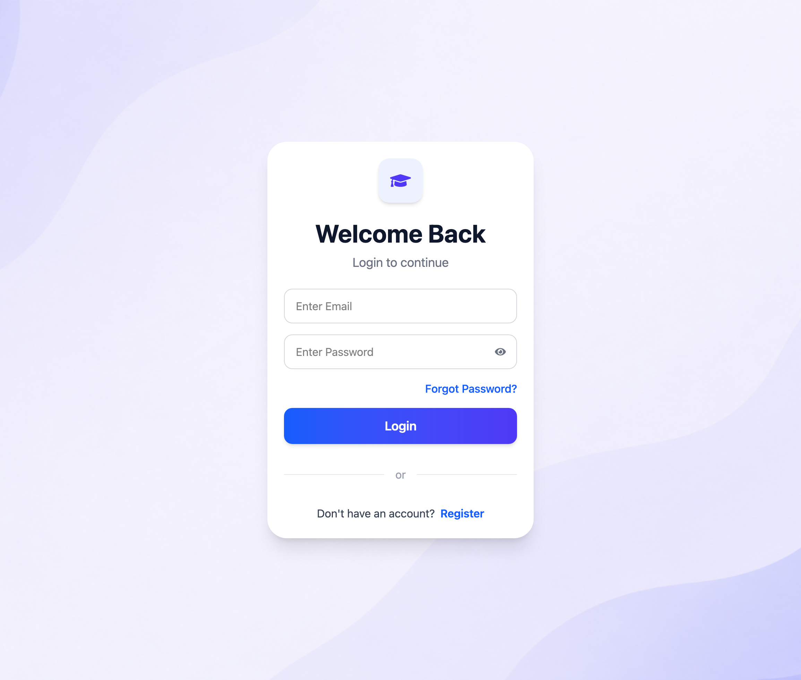

### Dashboard

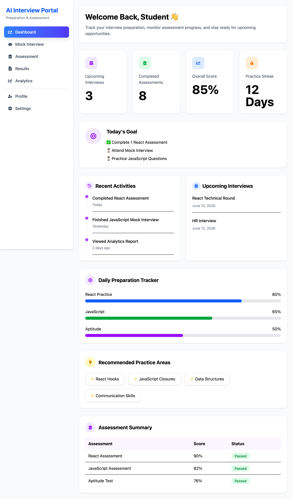

### Assessment

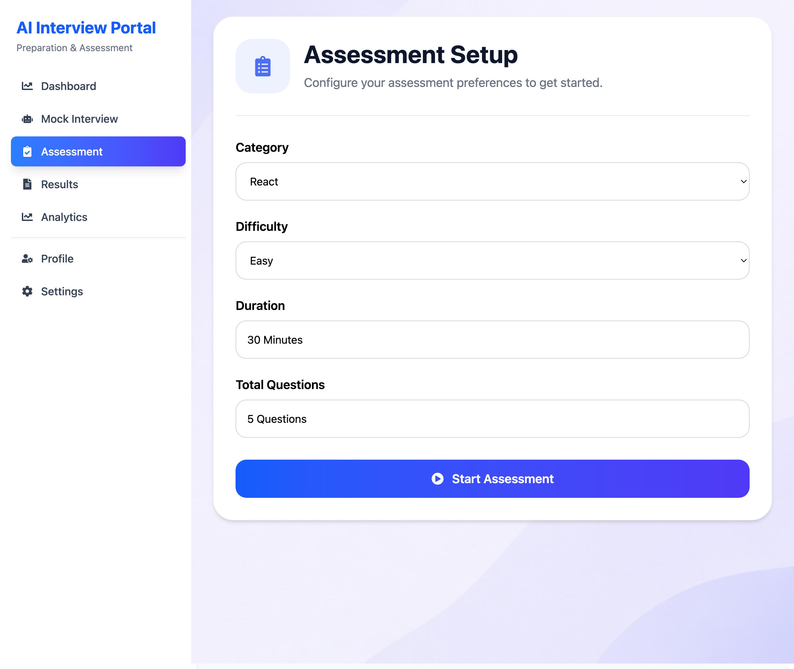

### Mock Interview

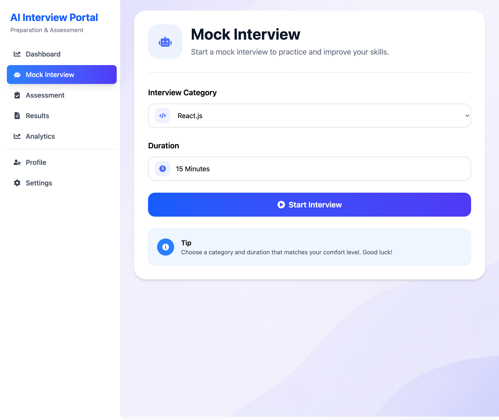

### Results

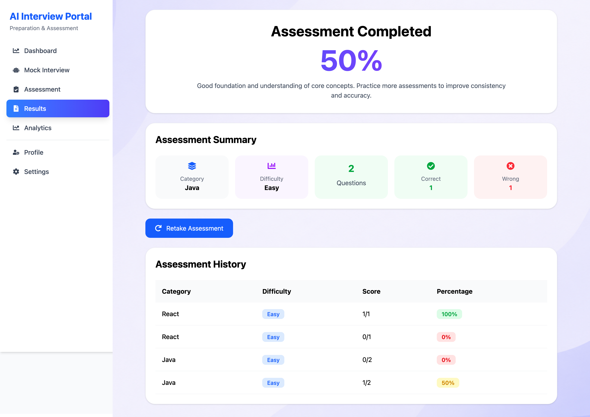

### Analytics

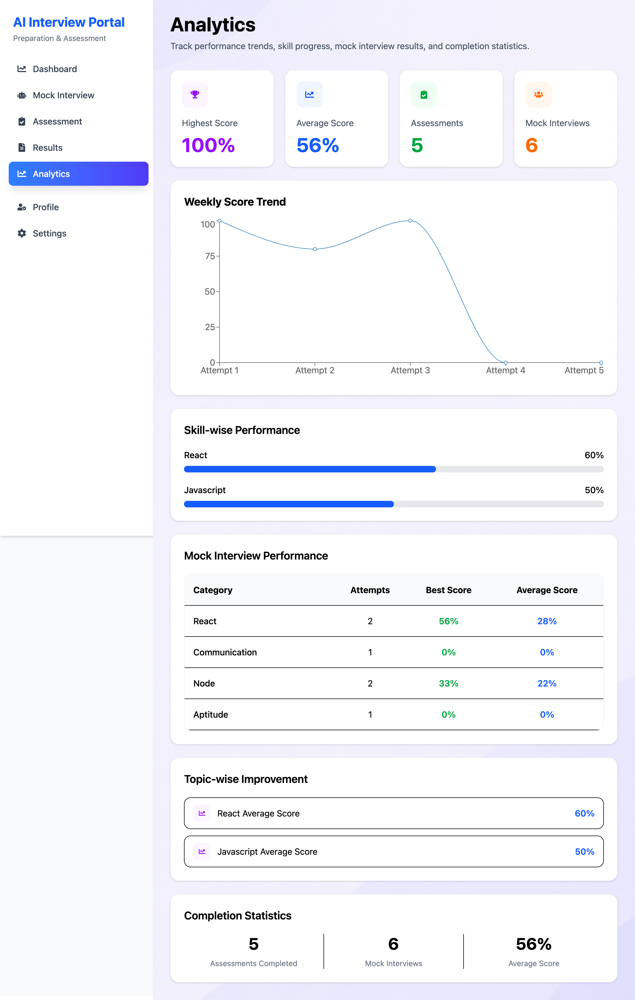

### Student Results

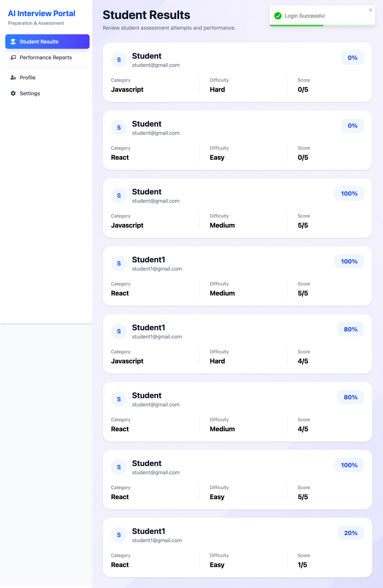

### Performance Reports

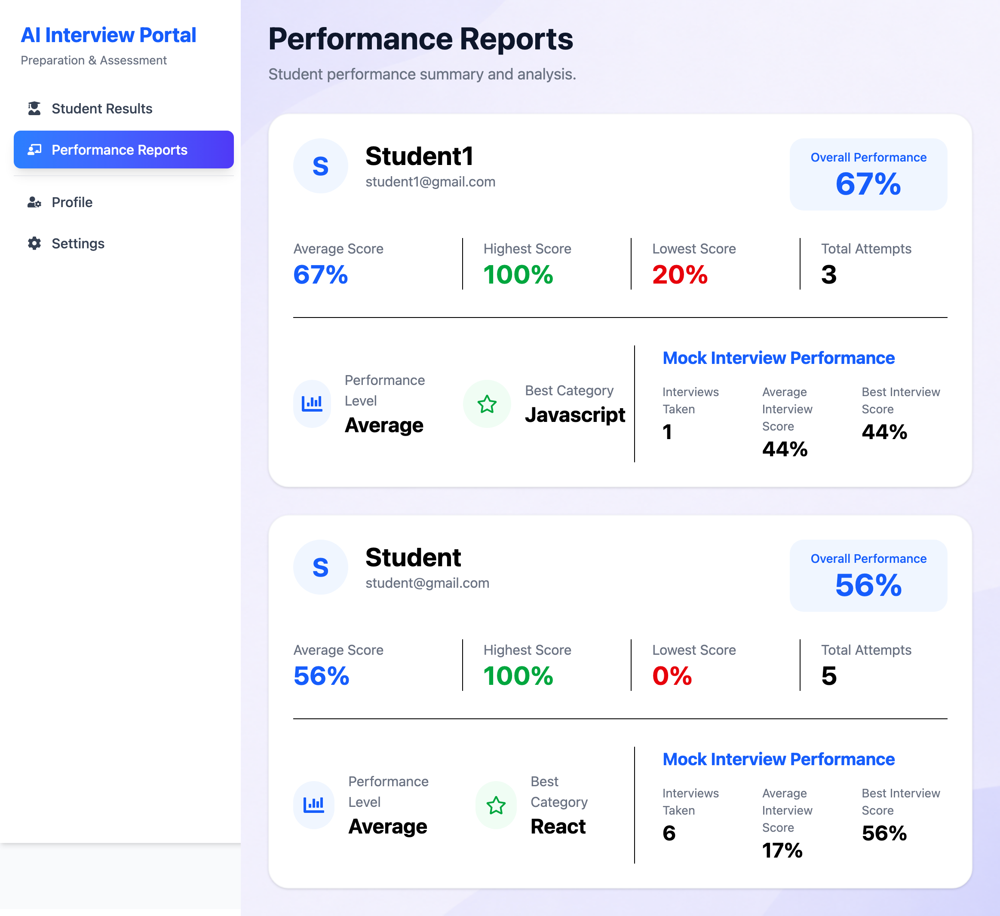

### User Management

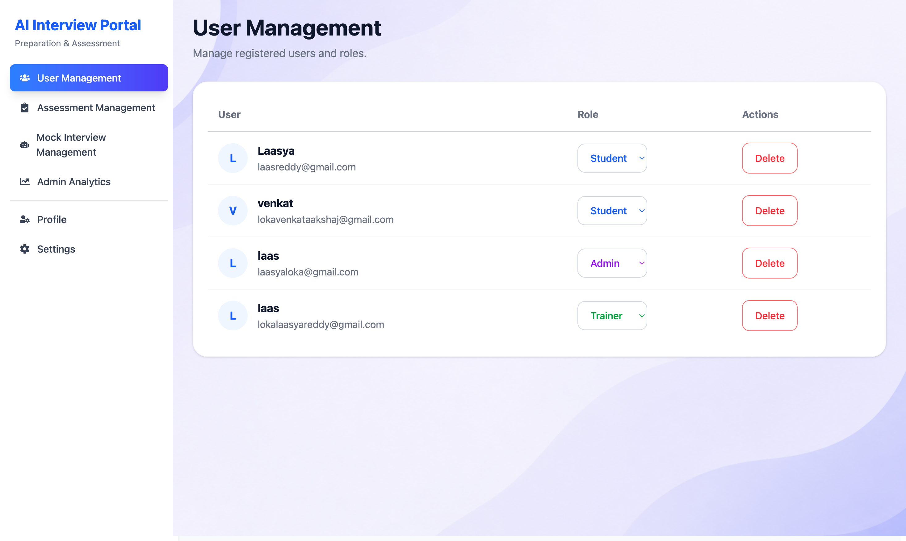

### Assessment Management

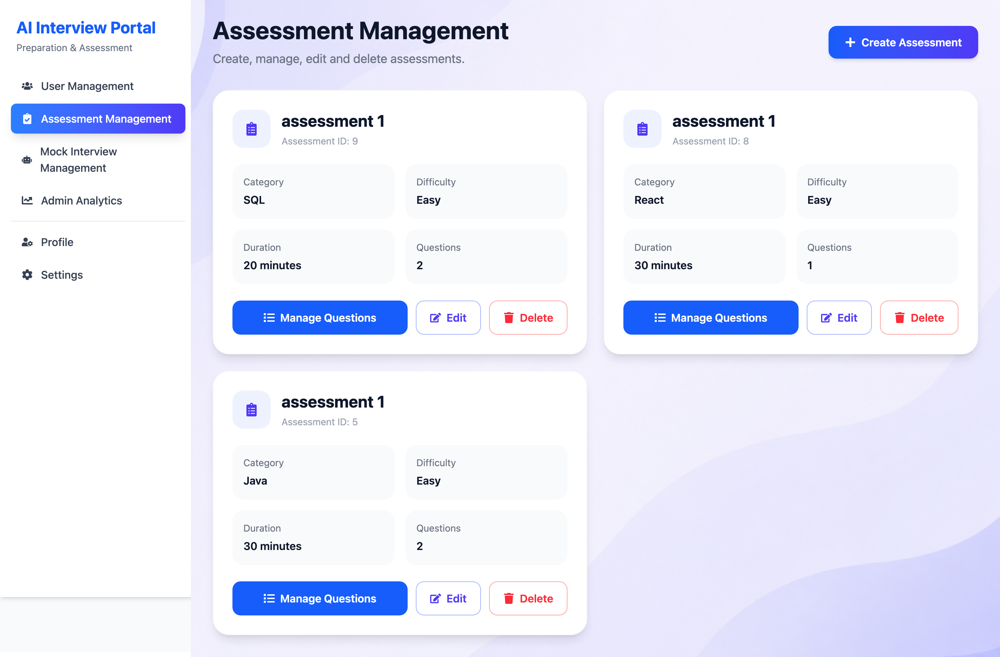

### Admin Analytics

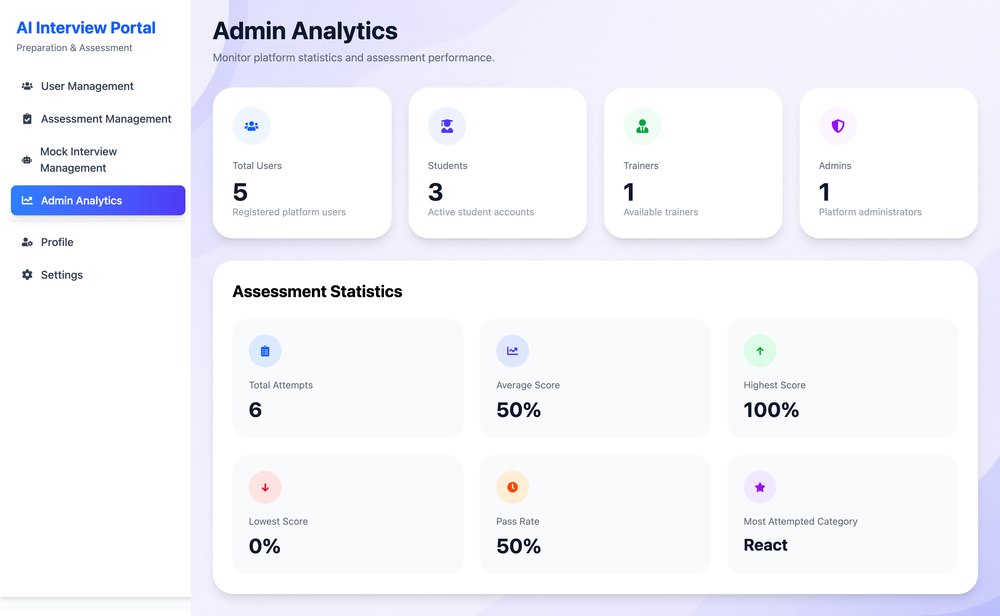

---

## Non-Functional Requirements Covered

### Performance

* Fast Client-Side Rendering
* Optimized React Components
* Responsive User Interface

### Security

* Protected Routes
* Secure Client-Side Access Control
* Form Validation

### Scalability

* Modular Architecture
* Reusable Components
* Maintainable Code Structure

### Accessibility

* Responsive Design
* Keyboard Accessible Elements
* Proper Form Labels

---

## Future Enhancements

* Backend Integration
* Real API Integration
* JWT Authentication
* AI-Powered Interview Evaluation
* Email Notifications
* Dark Mode
* Unit Testing
* Advanced Analytics
* Export Reports
* Real-Time Monitoring

---

## Deployment

### GitHub Repository

https://github.com/laasyareddy-create/AI-Interview-Portal

### Live Application

Live deployment can be configured using Vercel.


